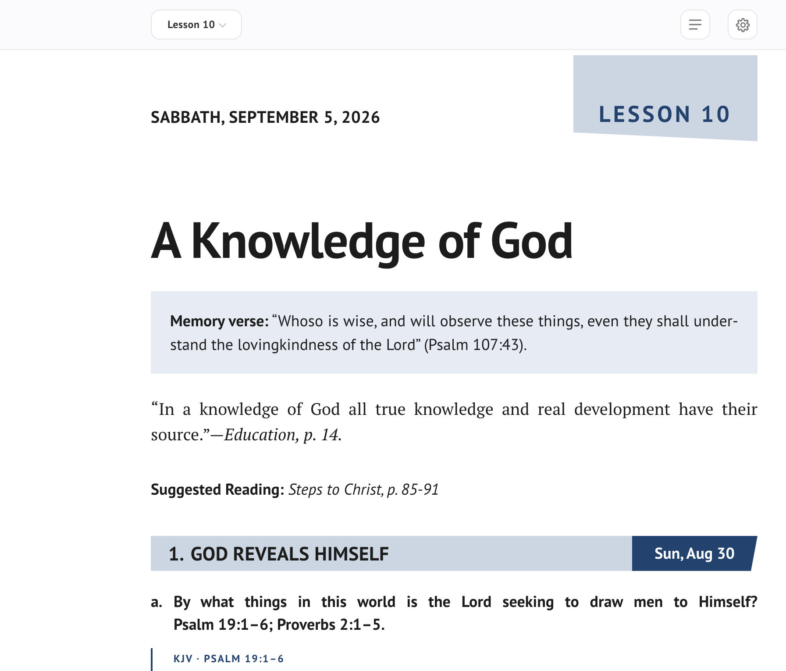
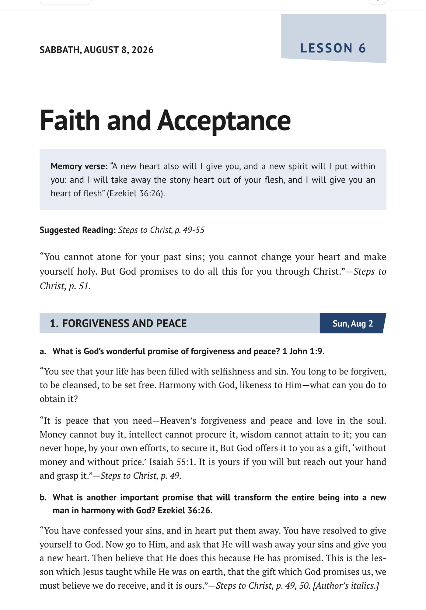
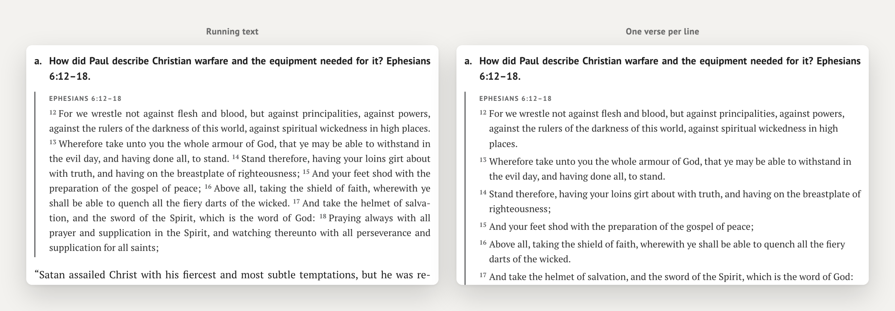
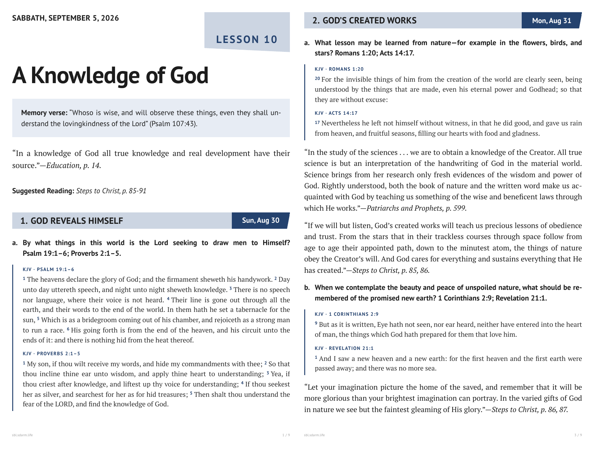
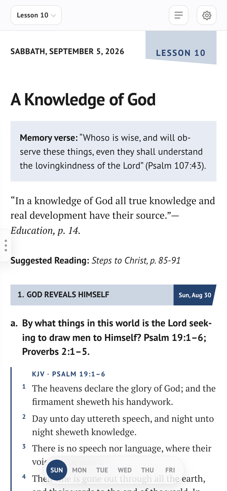
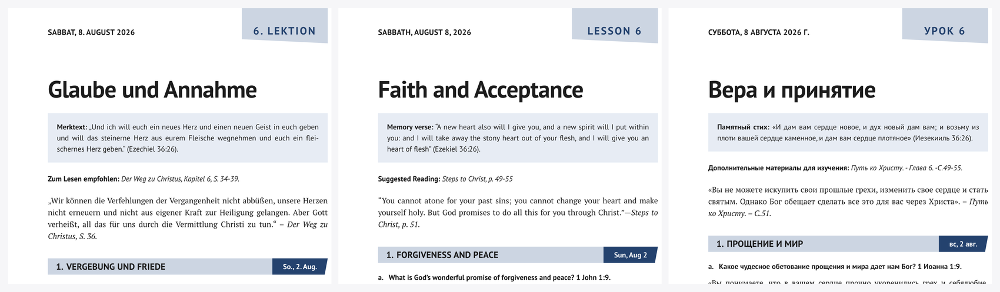
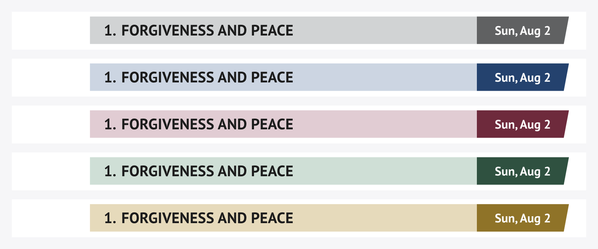

# S B L&nbsp;&nbsp;&nbsp;E D I T I O N

**The weekly Sabbath Bible Lesson in its original booklet layout — ready to save as PDF.**

An independent edition of the SDARM Sabbath Bible Lessons

 

 

  

### [**▶&nbsp; Open the live page**](https://themaestr-o.github.io/sbl/)

 

## What it is

The **Sabbath Bible Lesson** — the weekly Bible study booklet of the [Seventh Day Adventist Reform Movement](https://sdarm.org) — rendered as **one clean page you can save as PDF**.

Not a reading app. A **digital typesetting** of one particular publication: the same grey section bands, the same lesson tag, the same memory-verse box, the same grid as the printed quarterly. What you save is what the church hands out.

One language at a time — **German · English · Russian** — with the full Bible text pulled live from SDARM, and everything cached so it keeps working without internet.

 

 

## Two ways to show the verses

Press **Verses** to print the full Bible text under every reference, then **≡** to choose how it is set:

| | |
|---|---|
| **Running text** | Verses flow as one paragraph with small raised numbers — the way the booklet prints them |
| **One verse per line** | Each verse starts a new line, its number hanging in the margin — for slow, careful study |

The reference above the passage, the verse number and the first word of the question all sit on **one vertical line**.

 

## Save as PDF

**↓ PDF** asks what to save:

| | |
|---|---|
| **This week** | One lesson — about 8 pages |
| **Whole quarter** | All 13 lessons in a single file, each opening on a new page |

The choice also switches what the page shows, so the whole quarter can be scrolled through before saving. Margins, page numbers and the address line are set in the document itself — in the print dialog just switch **Headers and footers off** and the file comes out clean.

Long quotes and verse groups flow across the page break instead of jumping whole to the next sheet; headings never end a page on their own.

 

## On the phone

The toolbar folds into two rows and stays there — nothing wraps out of view down to 320 px. On a narrow screen justified text is set ragged-right instead, so no rivers of white run through the paragraphs. The PDF is unaffected: every phone rule sits behind `@media screen`.

 

## Three languages

Lesson text and Bible in **Luther 1912**, **King James** and the **Синодальный перевод**. Quotes from the Spirit of Prophecy carry their source, book title in italics — in all three languages.

 

## Colour the bands

Five presets — grey, the quarterly's cover navy, wine, forest, gold — or any colour of your own from the wheel. The tint carries through the bands, the day tags, the verse rules and the colophon, and it is remembered.

 

## The controls

| | |
|---|---|
| **‹ ›** | Move a week at a time — a quarter at a time when the whole quarter is shown. Tap the label to jump back to this week |
| **DE · EN · RU** | The language of both the lesson and the Bible |
| **Verses** | Print the full Bible text under each reference |
| **≡** | Running text, or one verse per line |
| **↓ PDF** | Save this week, or the whole quarter in one file |
| **◼** | Colour of the bands |

 

## Data & offline

Everything is fetched live from the church's own source, `app.sdarm.org` — lesson texts and the Bible editions alike. Nothing is copied into this repository and nothing is rewritten; the page only sets the official text.

After the first visit a service worker keeps the quarter and the Bible, so the lesson opens instantly and works with no connection.

No build step, no framework, no dependencies — one HTML file and a service worker.

 

## Three ways to the same lesson

| | |
|---|---|
| **SBL Edition** — this one | **One** language, exact booklet layout, made for the **PDF** |
| [**manna**](https://github.com/TheMaestr-o/manna) | The same lesson in **two languages side by side**, for reading and comparing translations |
| [**MANNA-Photoshop-Lessons**](https://github.com/TheMaestr-o/MANNA-Photoshop-Lessons) | The daily lesson as a panel **inside Adobe Photoshop** |

 

## Notes

- Lesson content © [Seventh Day Adventist Reform Movement](https://sdarm.org); Bible text from SDARM's own editions. An independent reader, not affiliated with SDARM.
- A quarter holds 13 lessons; each runs Sunday to Friday, with the Sabbath carrying the week's overview and memory verse.

 

## Support & Contact

## License

Free to download and use. **© 2026 Sergio (Maestro).**

 

---

Sabbath School · Sabbath Bible Lessons · SDARM · Seventh Day Adventist Reform Movement · Adventist · church · Christian · Bible study · Scripture · devotional · quarterly  **АСДРД** · Адвентисты Седьмого Дня Реформационного Движения · урок субботней школы · субботняя школа · Библия · церковь · пособие по изучению Библии · квартальник  STA Reformationsbewegung · Sabbatschule · Sabbatschullektion · Bibelstudium · Gemeinde · Siebenten-Tags-Adventisten Reformationsbewegung

`#church` `#bible` `#biblestudy` `#sabbath` `#sabbathschool` `#adventist` `#sdarm` `#scripture` `#devotional` `#christian` `#pdf` `#printcss` `#booklet` `#typography` `#githubpages` `#offlinefirst` `#multilingual`

