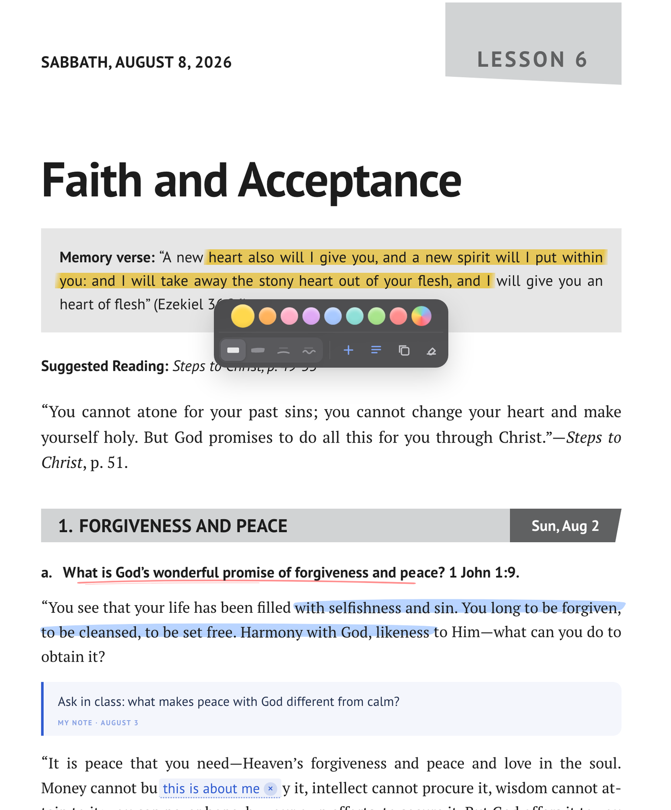
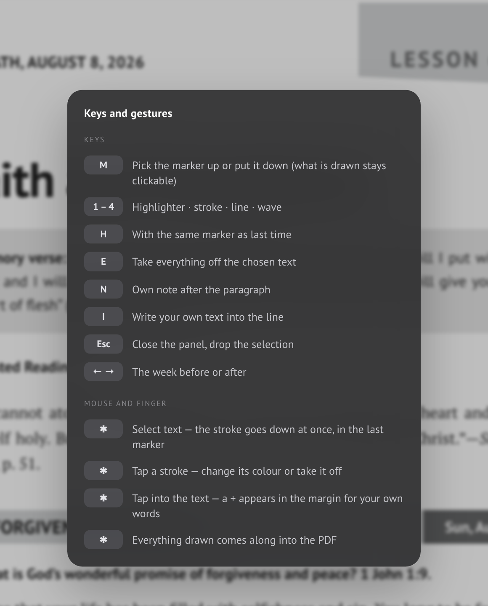
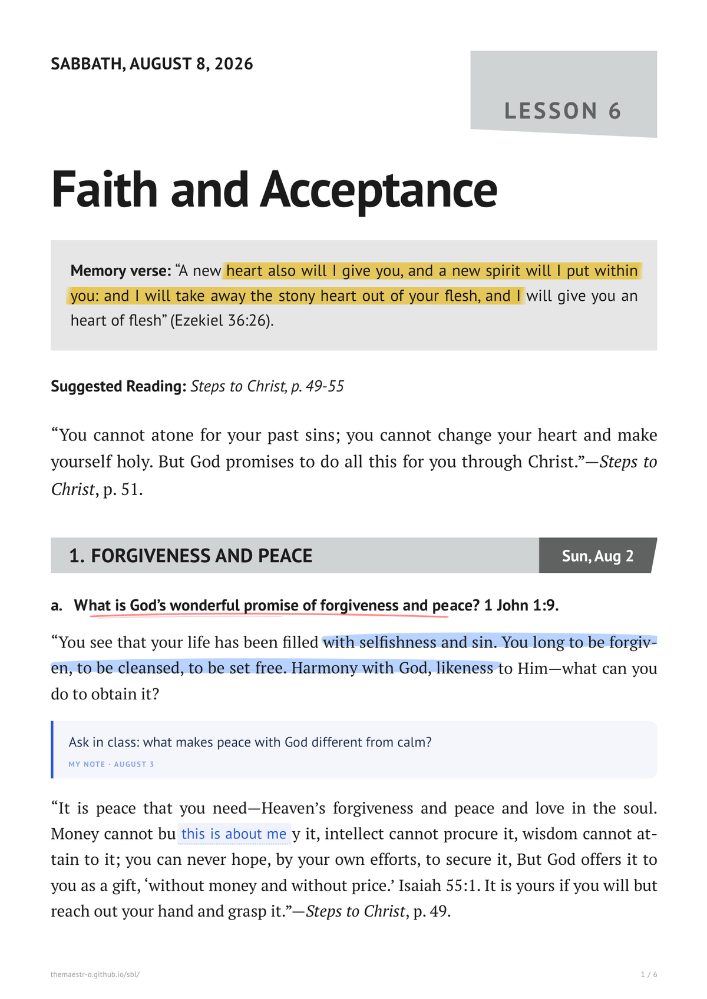

# S B L&nbsp;&nbsp;&nbsp;E D I T I O N

**The weekly Sabbath Bible Lesson in its original booklet layout — mark it, write on it, save it as PDF.**

An independent edition of the SDARM Sabbath Bible Lessons

 

 

  

### [**▶&nbsp; Open the live page**](https://themaestr-o.github.io/sbl/)

 

## What it is

The **Sabbath Bible Lesson** — the weekly Bible study booklet of the [Seventh Day Adventist Reform Movement](https://sdarm.org) — rendered as **one clean page you can save as PDF**.

Not a reading app. A **digital typesetting** of one particular publication: the same grey section bands, the same lesson tag, the same memory-verse box, the same grid as the printed quarterly. What you save is what the church hands out.

One language at a time — **German · English · Russian** — with the full Bible text pulled live from SDARM, and everything cached so it keeps working without internet.

 

 

## Two ways to show the verses

Press **Verses** to print the full Bible text under every reference, then **≡** to choose how it is set:

| | |
|---|---|
| **Running text** | Verses flow as one paragraph with small raised numbers — the way the booklet prints them |
| **One verse per line** | Each verse starts a new line, its number hanging in the margin — for slow, careful study |

The reference above the passage, the verse number and the first word of the question all sit on **one vertical line**.

 

## A hand on the sheet &nbsp;new in 2.0

Select a line and the ink is **already there** — in the marker you used last. The panel that comes up only changes its colour afterwards, so what you see first is the finished thing, not a grey preview of it.

| | |
|---|---|
| **Four strokes** | Highlighter with the slanted sweep of a real felt pen, a rough-edged stroke, a hand-drawn line, a wave |
| **Any colour** | Eight last-used inks in the panel, the whole gamut behind the rainbow, and it is remembered |
| **Two passes go darker** | A second colour over the first behaves like real ink; the same colour twice does not muddy it |
| **Your own note** | After any paragraph — blue, in the other face, labelled and dated, so nobody mistakes it for the lesson |
| **Your own words in the line** | Click into the text and a caret shows the exact gap they will go into |
| **Kept in the browser** | Separately for every lesson and every language; they come back after a reload |

Put the marker down with **M** when you only want to read — what is already drawn stays clickable, so a stroke can still be recoloured or taken off.

Every key and gesture is listed under **⚙ → Shortcuts**, in the language of the lesson.

 

## It all prints

The ink is the background of the line itself, not an overlay pinned to the screen — so it flows with the text, breaks across pages with it, and arrives in the PDF exactly as it looked. At the foot of the sheet a line states that the blue is the reader's own and not part of the lesson.

 

## Save as PDF

**↓ PDF** asks what to save:

| | |
|---|---|
| **This week** | One lesson — about 8 pages |
| **Whole quarter** | All 13 lessons in a single file, each opening on a new page |

The choice also switches what the page shows, so the whole quarter can be scrolled through before saving — once the dialog closes, the lesson you were reading comes back. The file is named after what it holds (`SBL 2026-08-08 LESSON 6 Faith and Acceptance`). Sheet size, margins, page numbers and the address line are set in the document itself — in the print dialog just switch **Headers and footers off** and the file comes out clean.

Long quotes and verse groups flow across the page break instead of jumping whole to the next sheet. A day never opens at the foot of a page: its heading, the question it starts with and the beginning of the text that answers it travel over together. Words break by the rules of the language being read — the Russian and German columns are set as tightly as the English one.

 

## On the phone and the tablet

The toolbar folds into two rows and stays there — nothing wraps out of view down to 320 px. On a narrow screen justified text is set ragged-right instead, so no rivers of white run through the paragraphs. The PDF is unaffected: every phone rule sits behind `@media screen`.

Where the pointer is a finger, the marker panel grows to match: bigger inks, bigger buttons, a wider colour field, and the delete cross on a note always visible instead of waiting for a hover.

 

## Three languages

Lesson text and Bible in **Luther 1912**, **King James** and the **Синодальный перевод**. Quotes from the Spirit of Prophecy carry their source, book title in italics — in all three languages.

 

## Colour the bands

Five presets — grey, the quarterly's cover navy, wine, forest, gold — or any colour of your own from the wheel. The tint carries through the bands, the day tags, the verse rules and the colophon, and it is remembered.

 

## The controls

| | |
|---|---|
| **Lesson 6 ▾** | Opens the month: every week carries its lesson, and today is marked |
| **⚙** | Everything else — language, Bible text, type size, colour, marker, shortcuts, PDF |
| **← →** | A week at a time; a quarter at a time when the whole quarter is on screen |
| **M** | Pick the marker up or put it down |
| **1 – 4** | Highlighter · stroke · line · wave |
| **H · E** | Paint with the last marker · take everything off the chosen text |
| **N · I** | Your own note after the paragraph · your own words inside the line |

 

## What 2.0 brought

**The sheet can be marked.** Four strokes in any colour, laid down the moment the text is selected; two passes darken like real ink; the panel comes up below the selection and the browser's own menu no longer fights it. Everything is kept in the browser, per lesson and per language, and prints with the lesson.

**The reader can write on it.** A note after any paragraph and words inside the line itself — blue, in the other face, labelled and dated, with a line at the foot of the PDF saying they are not the lesson's own.

**The PDF was put right.** Words now break by the rules of the language being read: with the document fixed to English, Russian never hyphenated at all and German broke by the wrong rules — a whole quarter came out three pages longer and full of rivers. Printing waits for the type to be loaded instead of a timer. The sheet is A4 whatever the printer defaults to. A day heading no longer stands alone at the foot of a page. The lesson tag stopped printing into the top margin. The saved file is named after the lesson. Sending a quarter to the printer no longer leaves you stranded in the quarter afterwards. A stray booklet page number glued to the last word of a Russian review question is gone.

 

## Data & offline

Everything is fetched live from the church's own source, `app.sdarm.org` — lesson texts and the Bible editions alike. Nothing is copied into this repository and nothing is rewritten; the page only sets the official text.

After the first visit a service worker keeps the quarter and the Bible, so the lesson opens instantly and works with no connection.

No build step, no framework, no dependencies — one HTML file and a service worker.

 

## Three ways to the same lesson

| | |
|---|---|
| **SBL Edition** — this one | **One** language, exact booklet layout, made for the **PDF** |
| [**manna**](https://github.com/TheMaestr-o/manna) | The same lesson in **two languages side by side**, for reading and comparing translations |
| [**MANNA-Photoshop-Lessons**](https://github.com/TheMaestr-o/MANNA-Photoshop-Lessons) | The daily lesson as a panel **inside Adobe Photoshop** |

 

## Notes

- Lesson content © [Seventh Day Adventist Reform Movement](https://sdarm.org); Bible text from SDARM's own editions. An independent reader, not affiliated with SDARM.
- A quarter holds 13 lessons; each runs Sunday to Friday, with the Sabbath carrying the week's overview and memory verse.

 

## Support & Contact

## License

Free to download and use. **© 2026 Sergio (Maestro).**

 

---

**EN** — Sabbath School · Sabbath Bible Lessons · SDARM · Seventh Day Adventist Reform Movement · Bible study · church · devotional · quarterly

**RU** — АСДРД · Адвентисты Седьмого Дня Реформационного Движения · урок субботней школы · субботняя школа · Библия · церковь · квартальник

**DE** — STA Reformationsbewegung · Sabbatschule · Sabbatschullektion · Bibelstudium · Gemeinde

